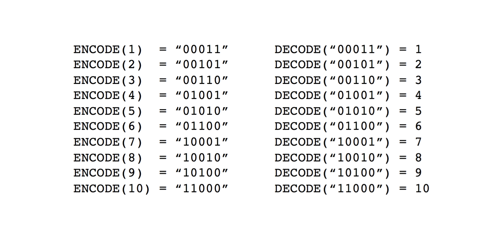

# `rust-bfield`, an implementation of the B-field probabilistic key-value data structure

[](https://crates.io/crates/bfield)

The B-field is a novel, probabilistic data structure for storing key-value pairs (or, said differently, it is a probabilistic associative array or map). B-fields support insertion (`insert`) and lookup (`get`) operations, and share a number of mathematical and performance properties with the well-known [Bloom filter](https://doi.org/10.1145/362686.362692).

At [One Codex](https://www.onecodex.com), we use the `rust-bfield` crate in bioinformatics applications to efficiently store associations between billions of $k$-length nucleotide substrings (["k-mers"](https://en.wikipedia.org/wiki/K-mer)) and [their taxonomic identity](https://www.ncbi.nlm.nih.gov/taxonomy) _**using only 6-7 bytes per `(kmer, value)` pair**_ for up to 100,000 unique taxonomic IDs (distinct values) and a 0.1% error rate. We hope others are able to use this library (or implementations in other languages) for applications in bioinformatics and beyond.

> _Note: In the [Implementation Details](#implementation-details) section below, we detail the use of this B-field implementation in Rust and use `code` formatting and English parameter names (e.g., we discuss the B-field being a data structure for storing `(key, value)` pairs). In the following [Formal Data Structure Details](#formal-data-structure-details) section, we detail the design and mechanics of the B-field using mathematical notation (i.e., we discuss it as an associate array mapping a set of_ $(x, y)$ _pairs). The [generated Rust documentation](https://docs.rs/bfield/latest/bfield/) includes both notations for ease of reference._

## Implementation Details

A B-field stores a `(key, value)` mapping **without directly storing either the keys or the values**. This permits highly space efficient association of `(key, value)` mappings, but comes at the cost of two classes of errors:

* False positives (which we later describe as occurring at a tunable rate of $\alpha$) in which the `get` operation for a `key` _that was not inserted into the B-field_ returns an incorrect `value`; and
* Indeterminacy errors (later described as occurring at a frequency of $\beta$) in which the `get` operation for a `key` returns an `Indeterminate` instead of a specific `value`. Note that this error can occur for both `keys` that were inserted into the B-field as well as those that were not. 

Both error categories can be minimized with appropriate [parameter selection](#parameter-selection), and it is trivial to achieve a zero or near-zero indeterminacy error rate (i.e., $\beta\approx0$).

### _Space Requirements_
While the space requirements for a B-field depends on the number of discrete values and the desired error rates, the following examples are illustrative use cases:

* Store 1 billion web URLs and...
  
  * Assign each of them one of a small number of categories values (n=8) in 2.22Gb (params include ν=8, κ=1, 𝛼=0.1%; 19 bits per element)
  * Store their IPv4 prefix (n=32) in 3.16Gb (ν=24, κ=2, 𝛼=0.1%; 27 bits per element)
  * Store their IP in an `0.0.0.0/8` address block (n=16,777,216) in 8.9Gb (ν=51, κ=6, 𝛼=0.1%; 76 bits per element)
  * Determine if they are part of the set (a Bloom filter!) in 1.75Gb (params include ν=1, κ=1, 𝛼=0.1%; 15 bits per element)

    > _We don't estimate space savings over alternative data structures, but any structure storing URLs averaging ~40 bytes per key will several-fold larger than even a B-field associating keys with ~16M distinct values._

* Store 1 billion DNA or RNA _k_-mers ("ACGTA...") and...
  * Associate them with any of the ~500k bacterial IDs current described by NCBI in 6.93Gb (ν=62, κ=4, 𝛼=0.1%; 59 bits per element)
  * Store which of 1000 datasets they were most frequently observed in using 3.65Gb (ν=46, κ=2, 𝛼=0.1%; 31 bits per element)
  * Quantify their abundance in a dataset(s) (say with ~100 quantized values) in 2.91Gb (ν=15, κ=2, 𝛼=0.1%; 25 bits per element)

    > _Compare this to a naive implementation storing 2-bit encoded 32-mers (or 8 amino acid character) and an associated 32 bit value, requiring 96 bits per element without any indexing or data structure overhead._


### _🛠 Supported Operations & Example Code_
This implementation provides the following core functionality:

* A B-field can be created with the `create` function (see [parameter selection](#parameter-selection) for additional details) and then by iteratively inserting `(key, value)` pairs with the `insert` function:

```rust
use bfield::BField;

let tmp_dir = tempfile::tempdir().unwrap();

// Create a B-field in a temporary directory
// with a 1M bit array, 10 hash functions (k), a marker
// width of 39 (ν), weight of 4 (κ), 4 secondary arrays, and
// an uncorrected β error of 0.1
let mut bfield: BField<String> = BField::create(
    "/tmp/",         // directory
    "bfield",        // filename (used as base filename)
    1_000_000,       // size (in bits)
    10,              // n_hashes (k)
    39,              // marker_width (ν)
    4,               // n_marker_bits (weight / κ)
    0.1,             // secondary_scaledown (uncorrected β)
    0.025,           // max_scaledown
    4,               // n_secondaries
    false,           // in_memory
    String::new()    // other_params
).expect("Failed to build B-field");

// Insert integers 0-10,000 as key-value pairs (10k keys, 10k distinct values)
for p in 0..4u32 {
    for i in 0..10_000u32 {
        bfield.insert(&i.to_be_bytes().to_vec(), i, p as usize);
    }
}
```

* After creation, a B-field can optionally be loaded from a directory containing the produced `mmap` and related files with the `load` function. And once created or loaded, a B-field can be directly queried using the `get` function, which will either return `None`, `Indeterminate`, or `Some(BFieldValue)` (which is currently an alias for `Some(u32)` see [limitations](#⚠️-current-limitations-of-the-rust-bfield-implementation) below for more details):

```rust no_run
use bfield::BField;

// Load based on filename of the first array ".0.bfd"
let bfield: BField<String> = BField::load("/tmp/bfield.0.bfd", true).expect("Failed to load B-field");

for i in 0..10_000u32 {
    let value = bfield.get(&i.to_be_bytes().to_vec());
}
```

Additional documentation can be generated using `cargo docs` and is hosted [on docs.rs](...) for the latest `rust-bfield` release.

### _🚧 Current Limitations of the `rust-bfield` Implementation_
This implementation has several current limitations:
* **`u32` Values**: Currently, this implementation only permits storing `u32` values, though those can trivially be mapped to any other arbitrary values, e.g., by using them as indices for an array of mapped values (`[value1, value2, value3, ...]`).
* **No Parameter Selection Assistance**: Currently, the `create` function requires manually specifying all of the B-field parameters. A future interface might automatically (and deterministically) select optimal parameters based on input information about the number of discrete `values` ( $\theta$ below) and desired false positive and indeterminacy error rates ( $\alpha$ and $\beta$ below, respectively).
* **No Higher-Level Insertion Management**: Because creation of a B-field with no indeterminacy error $(\beta\approx0)$ requires setting `n_secondaries` number of inserts (e.g., ~4), it is necessary to iterate through all inserted elements `n_secondaries` times (see [benchmark.rs](benches/benchmark.rs) for a crude example). A higher-level insertion function would take an `Iterable` data structure and manage performing the proper number of repeated insertions for the end-user.


## Formal Data Structure Details

### _Overview_

In contrast to Bloom filters, which only support set membership queries, B-fields enable efficiently storing a set of $x, y$ key-value pairs, where $S$ is the set of $n$ stored $x$ values $(|S|=n)$, $D$ is the set of all possible $y$ values $(f:S \to D)$, and $\theta$ represents the "value range" of the B-field $(max(D)=\theta)$. Put differently, if $f(x)=y$ is the function that maps all $x$ values to their corresponding $y$ value, such that $f(x)=y$, $D$ is the domain of the function $f(x)$.

B-fields have a number of advantages of other probabilistic and deterministic data structures for associating keys and values. Specifically, B-fields exhibit a unique combination of properties that makes them ideal for storing very large sets of keys mapped to a modest number of discrete values:

* **Space Efficiency**: B-fields probabilistically store key-value pairs in a highly space-efficient manner optimized for in-memory use. For many common use cases or configurations, it is possible to store many billions of elements using only tens of gigabytes of storage (or a few bytes per key-value pair). These space requirements scale linearly with the number of elements in the B-field $n$ (i.e., B-fields have $O(n)$ space complexity).
* **Speed**: B-fields are optimized for in-memory storage of key-value pairs and require little computational overhead and few memory accesses (implementation speed should resemble that of a Bloom filter). All B-field insert and lookup operations have $O(1)$ time complexity.
* **Well-Defined and Bounded Errors**: Three major types of errors are possible with probabilistic associative arrays:
    * **False Positives**: A false positive occurs when a data structure returns a value for $y$ when $x\notin S$ (vs. returning `None` or equivalent). B-fields do exhibit false positives at an error rate of $\alpha$. At the cost of reduced space efficiency, it is possible to select parameters that result in $\alpha$ being arbitrarily small. False positives are a common feature of probabilistic data structures, but a disadvantage of the B-field versus deterministic data structures (e.g., a hash table).
    * **Indeterminacy**: An indeterminacy error, denoted $\beta$, is the rate at which a data structure returns two or more possible values $y$ for an element $x \in S$. This can take the form of a vector of possible $y$ values or an error type (e.g., this implementation returns `Indeterminate`). While the internal arrays that together comprise a B-field each independently exhibit substantial $\beta$ errors, appropriate B-field parameter selection allows $\beta = 0$ or $\beta \approx 0$.
    * **Erroneous Retrieval / Mismapping**: An erroneous retrieval or mismapping error $\gamma$ occurs when a data structure is queries for an $x \in S$ and returns the wrong value of $y$ such that $f(x) \ne y$. Erroneous retrievals are not possible with B-fields.

### _Implementing a B-field_

> ⚠️ Warning: This section provides a detailed overview of the math underlying the B-field data structure and is intended for those interested in those mechanics or those implementing a new B-field library. Many readers may prefer to skip ahead to the [Summarizing B-field Properties](#summarizing-b-field-properties) subsection.

The B-field works by encoding $y$ into a binary pattern or string and then inserting that binary pattern into a series of bit arrays using $k$ distinct hash functions $(h_{1}..h_{k})$ for each inserted element $x$. While many of the implementation details that follow will be familiar to those acquainted with hash-based data structures in general and Bloom filters specifically, the B-field is designed for storing key-value  pairs rather than simple set membership information. The basic construction of a B-field requires each of the following steps:

#### **1. Configuration.** 
As the first step, the user needs to select several configuration options, which will determinate how the initial B-field is constructed. These key configuration variables are:

(a) The desired maximum false positive rate $\alpha$.
    
(b) The expected number of values to be stored $n$ where $n=|S|$. If more than $n$ elements are inserted into the B-field, the expected false positive rate will exceed $\alpha$.

(c) The maximum value $\theta$ of the set of all possible $y$ values. Note that using the default encoding system outlined here, the range of $y$ values $D$ must consist of all or a subset of the non-negative integers $\{1, ...,  \theta\}$ or $\{0, ..., \theta - 1\}$. This can, however, be easily mapped to any set of up to $\theta$ distinct values by simply using $y$ as an index or pointer to a value in a set $D\prime$ where $|D\prime| = \theta$ (in which case $y$ serves as an intermediate value).

(d) The value $\nu$ and a value $\kappa$ such that ${\nu \choose \kappa}\ge\theta$, where ${\nu \choose \kappa}$ is simply the combination formula, but using $\nu$ as the parameter instead of the more common $n$ (which is used for B-fields and Bloom filters to denote the cardinality of $S$ or $|S|$) and $\kappa$ in place of the more common $k$ (which is used to enumerate the number of required hash functions $h_{1}...h_{k}$):

$${\nu \choose \kappa}=\frac{\nu!}{\kappa!(\nu-\kappa)!}$$

As the B-field encodes the values $y$ in $\nu$-length bit-strings with exactly $\kappa$ ones (or a Hamming weight of $\kappa$ in information theoretic terms), it is best to both: (i) minimize $\kappa$; and (ii) keep $\nu$ within an order of magnitude of $\kappa$ while selecting $\nu$ and $\kappa$. For example, in choosing values for $\nu$ and $\kappa$ such that ${\nu \choose \kappa} \ge 1000$ it is preferable to set $\nu = 20$ and $\kappa = 3$ $({\nu \choose \kappa} = 1140)$ instead of setting $\nu = 1000$ and $\kappa = 1$. The reasons for this should become clear in the proceeding discussion of error rates and the B-field's operation.

#### **2. Bit Array Sizing and Hash Function Selection.** 
Next, it is necessary to select a size for the primary bit array used in the B-field and select an appropriate number of hash functions $k$. As the B-field hashes the input keys into a bit array in a manner similar to a Bloom filter, the same underlying formulas may be used for selecting the optimal size of the bit array and number of hash functions, with the exception that a B-field requires an $m\kappa$-bit array vs. the $m$-bit array required by a simple Bloom filter (here $p$ represents the probability of a single bit error, which is defined further below in 5b):

$$m=-\frac{{n\ln p}}{(\ln2)^{2}}$$
$$k=\frac{m}{n}\ln2$$

With regards to the selection of the hash function itself, any hash function with good pseudorandomness and distribution qualities will suffice for the B-field. While the prior equations assume a perfectly random hash function, the B-field performs comparably with non-cryptographic hash functions (such as MurmurHash3 or similar hash functions). Again, while the set of hash functions should in theory be fully independent, in practice it is possible (and preferable for performance reasons) to simply use 2 independent hash functions as seeds and then relax the independence requirements for the remaining hash functions, i.e., two seed hash functions $h_{a}(x)$ and $h_{b}(x)$ can be used to create $k$ composite hash functions with each defined as $h_{k}(x)=h_{a}(x) \times ((n-1) \times h_{b}(x))$ (see [Kirsch and Mitzenmacher 2008](http://dx.doi.org/10.1002/rsa.20208) for details)

#### **3. Bit Array Allocation.** 
Now having calculated $m$ and selected $\kappa$, we allocate an $m\kappa$-bit array of memory, setting all bits initially to 0. Note that the B-field may make use of multiple bit arrays and this initial $m\kappa$-bit array is termed the B-field $\mathtt{Array_{0}}$.

#### **4. Key-Value Insertion.** 
Next, the keys of the B-field $(x_{1}...x_{n})$ and their corresponding values $(y_{1}...y_{n})$ are inserted. This requires two steps or functions for all $x$ in $x_{1}...x_{n}$.

(a) $\mathtt{ENCODE}$. The $\mathtt{ENCODE}$ operation translates a given value $y$ into a binary $\nu$-length string with $\kappa$ 1s for insertion into the B-field primary array $(\mathtt{Array_{0}})$. Using the standard encoding system, this simply involves translating $y$ into the $y^{th}$ $\nu$-length $\kappa$-weight bit-string of all $\nu \choose \kappa$ combinations in lexicographic order (e.g., 1 translates to `0001` if $\nu = 4$ and $\kappa = 1$). Other even- and uneven-weighted coding schemes could also be used in this step (e.g., error-correcting codes), but are not detailed or further evaluated here. Figure 1 illustrates how the $\mathtt{ENCODE}$ (and $\mathtt{DECODE}$) operation works where $\nu = 5, \kappa = 2$.



**Figure 1:** Sample $\mathtt{ENCODE}$ and $\mathtt{DECODE}$ operations for $\nu = 5$ and $\kappa = 2$.

(b) $\mathtt{INSERT}$. The $\mathtt{INSERT}$ operation places the coded value $y$ (associated with the key $x$) into the B-field. First, the $k$ hash functions are applied to $x$ $(h_{1}(x)...h_{k}(x))$ and the $\mathtt{mod}(m\kappa)$ of each value is taken (i.e., the modulo operation is applied to the hashed value $h(x)$ using the size of the bit array $m\kappa$). These $k$ hashed values, where $0 \le h(x) \mathtt{mod} m\kappa \le m\kappa$, serve as indices for the bitwise OR insertion of the coded value $y$, where the first bit of the $\nu$-length bit-string is $h(x) \mathtt{mod} m\kappa$ and the last bit is $h(x) \mathtt{mod} m\kappa + \nu - 1$. In the case of inserting the first $x, y$ key-value pair into an empty $\mathtt{Array_{0}}$ where $k=6, \nu=5, \kappa=2$ and $y=2$ (impractically small values but useful for illustration), the result would be bitwise ORing the bit-string `00101` into the $m\kappa$-bit array 6 times $(k=6)$ and flipping a total of 12 bits from 0 to 1 ($k \times \kappa$). Figure 2 illustrates a sample $\mathtt{INSERT}$ operation for a key-value pair where the value $y=2$ and the B-field is configured with $\nu = 5, \kappa = 2$ and $k=6$. The pictured operation is the same for insertion into $\mathtt{Array_{0}}$ or any secondary array (described further below).


**Figure 2:** Sample $\mathtt{INSERT}$ operation: (a) Hash an input key $x$ $k$ times, providing $k$ indices for positions in a B-field array; (b) Encode the value $y$ associated with the key $x$ into a $\nu$-length, $\kappa$-weight bit-string (here $y=2, \nu=5$ and $\kappa=2$); and (c) Perform a bitwise OR between a $\nu$-length slice of the array and the encoded $\nu$-length bit-string representing the coded value $y$, for all $k$ hash functions $h_{1}(x)...h_{k}(x)$.

#### **5. Construction of Subsequent B-field Arrays**
In order to describe the construction of subsequent arrays $\mathtt{Array_{1}}...\mathtt{Array_{a-1}}$ where $a$ is the total number of bit arrays in the B-field, we briefly highlight: (a) how the $\mathtt{LOOKUP}$ operation is performed; and (b) the different types of error in the B-field as constructed thus far.

#### **5(a). The $\mathtt{LOOKUP}$ operation.** 
The $\mathtt{LOOKUP}$ operation mirrors the $\mathtt{INSERT}$. For a given $x_{i}$, we hash $x_{i}$ $k$ times using the hash functions $h_{1}...h_{k}$ (all $\mathtt{mod} m\kappa$). At each index position for $h_{1}(x_{i})...h_{k}(x_{i})$ a $\nu$-length bit string is taken and bitwise ANDed with an initial $\nu$-length bit-string consisting of all 1s (i.e., having a Hamming weight of $\nu$). Using the values from the prior example in Figure 2, if the following 6 5-bit strings $\{10101, 11111, 00111, 11111, 00101, 11101\}$ are found in the B-field $\mathtt{Array_{0}}$ at $h_{1}(x_{i})...h_{k}(x_{i})$, the bitwise AND of these returns $00101$ which we $\mathtt{DECODE}$ to the yield the value 2 for $y_{i}$. Figure 3 details this sample $\mathtt{LOOKUP}$ operation.

A $\mathtt{LOOKUP}$ operation can yield any of the following:

* A bit string with a Hamming weight $\lt \kappa$ indicates $x \notin S$. This is due to the fact that the `INSERT` operation detailed in 4(b) inserts $\kappa$ 1s with a bitwise OR, guaranteeing that at least $\kappa$ 1s will be returned via any subsequent $\mathtt{LOOKUP}$ of the same element. In this case, a B-field implementation should return `None` or a similar value that represents an $x_{i} \notin S$.

* A bit string with a Hamming weight $=\kappa$. In this case, we $\mathtt{DECODE}$ the resulting bit string (simply the inverse of the $\mathtt{ENCODE}$ operation detailed in Figure 1) and the value $y_{i}$ mapping to the key $x_{i}$ is returned. This operation will erroneously return a $y_{i}$ for an $x \notin S$ at the false positive rate of $\alpha$ (derived below in 5(b)). 

* Finally, a bit string with a Hamming weight of $\gt \kappa$ will be retrieved with a probability of $\beta$ (also derived below in 5(b)). This represents an `Indeterminate` result with more than $\kappa$ 1s. The dramatic reduction of $\beta$ is achieved via the construction of subsequent B-field arrays $\mathtt{Array_{1}}...\mathtt{Array_{a-1}}$.


**Figure 3:** Sample $\mathtt{LOOKUP}$ operation: (a) A key $x$ is hashed $k$ times, and $\nu$-length, $\kappa$-weight bit strings are extracted from the B-field array; (b) The $k$ bit strings are bitwise ANDed together; and (c) The resulting bit string is $\mathtt{DECODE}$-ed to recover the value $y$ associated with the key $x$.

#### **5(b). B-field error rates detailed.**
As noted above, the $\mathtt{LOOKUP}$ operation in B-field $\mathtt{Array_{0}}$ suffers from both false positive $(\alpha)$ and indeterminacy $(\beta)$ errors. These error rates can be simply derived based on the above $\mathtt{INSERT}$ operation's mechanics, which sets up to $\kappa$ random bits within the bit array to 1 for each of $k$ hash functions. Note that these properties and error rates mirror those of a Bloom filter and, indeed, a B-field where $\nu = 1, \kappa = 1$ and only a single bit array is used _is equivalent to a Bloom filter_ (since it sets a single bit with each operation).

First, we need to determine the probability that any single bit in the $\nu$-length bit string will be incorrect after the $k$ bit strings are bitwise ANDed together (described here as $p$, the probability of a single bit error). The probability that an individual bit is **not set** to 1 by a single hash function (each of which flips $\kappa$ bits) during the insertion of an element $x_{i}$ is:

$$1-\frac{\kappa}{m\kappa}$$

We can then cancel out $\kappa$:

$$1-\frac{1}{m}$$

Thus, the probability that a single bit is **not set** for any of the $k$ hash functions is:

$$(1-\frac{1}{m})^{k}$$

After $n$ insertions of $x_{1}...x_{n}$ into a bit array, the probability that a given bit remains 0 is:

$$(1 - \frac{1}{m})^{kn}$$

And the probability that it is set to 1 is:

$$1-(1 - \frac{1}{m})^{kn}$$

After each of the $k$ individual accesses that comprise the $\mathtt{LOOKUP}$ operation for a given bit array (one per hash function), the probability than an individual bit is incorrectly set to 1 is:

$$(1-(1-\frac{1}{m})^{kn})^{k} \approx (1-e^{-kn/m})^{k}$$

Substituting the formulas for optimal $m$ and $k$ values from above yields:

$$p=(1-e^{(-m/n \ln 2)n/m})^{(m/n \ln 2)}$$

Where $p$ is the probability that a given bit in the $\nu$-bit string encoding a given value $y_{i}$ is set to 1 before an $\mathtt{INSERT}$ operation is performed (i.e., that a subsequent $\mathtt{LOOKUP}$ will fail with a false positive or indeterminacy error). 

Using $p$, we can then derive the probability of a false positive for the overall $\mathtt{Array_{0}}$ of the B-field $(\alpha_{0})$. Since a false positive is defined as there being $\gt \kappa$ bits flipped to 1 in a $\nu$-bit string, $\alpha_{0}$ is $\mathit{CumBinom}(\nu, \kappa, p)$ where $\mathit{CumBinom}$ is the right tail of the cumulative binomial distribution:

$$\alpha=Pr(X\ge\kappa)=\sum_{i=\kappa}^{\nu}{\nu \choose i}p^{i}(1-p)^{\nu-i}$$

And, correspondingly, $\beta$ is the probability that a given value $x \in S$ returns a $\nu$-length bit string with $\gt \kappa$ bits flipped to 1 (at least $\kappa$ bits are guaranteed to be set ot 1 by the $\mathtt{INSERT}$ operation). This corresponds to $\mathit{CumBinom}(\nu - \kappa, 1, p)$. Without correction, $\beta$ is too high for many applications (though usable for others), and consequently, the next step in the B-field's construction is an effort to correct $\beta$ such that $\beta \approx 0$. This correction reduces $\alpha$ from the cumulative binomial distribution for all values $\ge \kappa$ to the binomial distribution for $\kappa$ exactly, which is ${\nu \choose \kappa}p^{\kappa}(1-p)^{\nu-\kappa}$.

#### **5(c). Reduction of $\beta$ Error through Construction of Additional Bit Arrays**
Given these error rates $\alpha$ and $\beta$, an additional correction is desirable. In order to (nearly) eliminate the indeterminacy error rate $\beta$ (and as a side effect, greatly reduce the magnitude of the false positive error rate $\alpha$), we iterate through all of the input keys $x_{1}...x_{n}$ an additional time after the first complete insert into $\mathtt{Array_{0}}$. This time, however, instead of inserting them into $\mathtt{Array_{0}}$, we perform a $\mathtt{LOOKUP}$ operation and note the Hamming weight of each $\nu$-bit string $(w_{i})$ for each $x_{i}$. If $w_{i} \gt \kappa$, we have an indeterminacy error as a known $x \in S$ is not returning its corresponding $\nu$-length $\kappa$-weight bit string. The subset of $x_{1}...x_{n}$ for which $w_{i} \gt \kappa$ to include $\beta n$ elements. This $\beta n$ subset is then inserted into a second array $\mathtt{Array_{1}}$, which is created following the above steps except it is scaled down to be a $\approx \beta m\kappa$ bits in size and stores only $\beta n$ elements instead of $n$ key-value pairs.

This secondary array $\mathtt{Array_{1}}$ allows for an indeterminate $\mathtt{LOOKUP}$ of $x_{i}$ in $\mathtt{Array_{0}}$ yield $\gt \kappa$ 1 bits to have a _second_ lookup performed against $\mathtt{Array_{1}}$. Since the probability of $x_{i}$ yielding $\gt \kappa$ 1 bits is $\beta$ for $\mathtt{Array_{0}}$ and also $\beta$ for $\mathtt{Array_{1}}$ (which shares identical parameters except for its overall size and number of stored key-value pairs), the indeterminacy rate is reducted from $\beta$ to $\beta^2$ with the addition of $\mathtt{Array_{1}}$.

Further arrays $\mathtt{Array_{2}}...\mathtt{Array_{a-1}}$ can be added until a set of $a$ arrays is formed, choosing $a$ such that $\beta^{a}n \lt 1$ (though in practice, it will often suffice to simply pick a value of $a$ such that only a handful of elements in $n$ will be inserted into $\mathtt{Array_{a-1}}$). These secondary arrays also have the effect of lowering the false positive rate $\alpha$ because a false positive where $x_{i} \notin S$ yielding $\gt \kappa$ 1 bits also leads to a check against $\mathtt{Array_{1}}$ (and $\mathtt{Array_{2}}...\mathtt{Array_{a-1}}$ as appropriate). This reduces the false positive rate $\alpha$ from the cumulative binomial towards the simple binomial ${\nu \choose \kappa}p^{\kappa}(1-p)^{\nu-\kappa}$. Alternatively, we can understand this as reducing the set of circumstances where $\alpha$ errors can occur from anytime $\ge \kappa$ 1 bits are flipped for an $x_{i} \notin S$ to two cases: (1) when exactly $\kappa$ 1 bits in $\mathtt{Array_{0}}$ for an $x_{i} \notin S$ (the simple binomial); or (2) the exceedingly rare case where $\gt \kappa$ 1 bits are flipped in $\mathtt{Array_{0}}...\mathtt{Array_{a-2}}$ and exactly $\kappa$ bits are flipped in $\mathtt{Array_{a-1}}$. The probability of the second case should be $\approx 0$ as the chance of $\gt \kappa$ bits flipping decreases exponentially with the addition of each secondary.

To summarize, this cascade of secondary arrays beyond $\mathtt{Array_{0}}$ $(\mathtt{Array_{1}}...\mathtt{Array_{a-1}})$ reduces the false positive rate $\alpha$ from a cumulative binomial distribution to the binomial for $\kappa$ individual bit-level errors and eliminates all indeterminacy errors (i.e., $\beta = 0$ or $\beta \approx 0$). And, this error reduction is achieved at quite modest cost to the space efficiency of the B-field. Recall that the original space requirements for $\mathtt{Array_{0}}$ of the B-field is $m\kappa$ bits where $m=-\frac{n \ln \alpha}{(\ln 2)^{2}}$ and $\kappa$ is selected for ${\nu \choose \kappa} \gt \theta$ where $\theta$ is the maximum value of the domain of stores values $y_{1}...y_{n}$ or $|D|$ in the case where $y_{1}...y_{n}$ is $1...n$. Consequently, $\mathtt{Array_{0}}$ requires $\beta^{0}m\kappa$ bits, while $\mathtt{Array_{1}}$ requires $\beta^{1}m\kappa$ and $\mathtt{Array_{a-1}}$ requires $\beta^{a-1}m\kappa$. Dividing everything by $m\kappa$ bits reveals the underlying geometreic series:

$$1+\beta^{1}+...+\beta^{a-1}$$

The sum of which is simply:

$$\frac{1}{1 - \beta}$$

Thus, the total space requirements for a B-field with a primary $\mathtt{Array_{0}}$ and $a - 1$ secondary arrays is only $\frac{1}{1-\beta}m\kappa$ bits. In many uses cases, an initial uncorrected indeterminacy rate of $0.05 \le \beta \le 0.20$ would not be uncommon. Correcting this for a 5.3% $(\frac{1}{0.95})$ or 25.0% $(\frac{1}{0.80})$ space penalty is generally a good tradeoff, though a B-field can be constructed with only $\mathtt{Array_{0}}$ at the cost of needing to manage $\beta$ indeterminacy errors in the key-value lookups.

### _Summarizing B-field Properties_
To briefly summarize, a B-field is a probabilistic associative array or map with the following unique set of properties:

* **Creation & Insertions**: $O(n)$ total creation time and $O(1)$ insertions, requiring an average of $\frac{\kappa}{1-\beta}$ hash computations and memory accesses, and $a\kappa$ hash computations and memory accesses in the worst case. A common value of $a$ would be $\approx 4$.

* **Lookups**: $O(1)$ lookups, requiring the same number of hash computations and memory accesses as an insertion.

* **Space Complexity**: $O(n)$ space complexity, requiring $\frac{m\kappa}{1-\beta}$ bits where $m$, $\kappa$, and $\beta$ are defined above ( $\mathtt{Array_{0}}$ requires $m\kappa$ bits, while the entire B-field requires an additional factor of $1 - \frac{1}{1-\beta}$).

### _Parameter Selection_
An efficient B-field requires optimal selection of $\nu$, $\kappa$, the B-field $\mathtt{Array_{0}}$ size $(m\kappa)$, and calculation of the required scaling factor for secondary arrays (uncorrected $\beta$). The 
[parameter selection notebook](docs/notebook/calculate-parameters.ipynb) included here provides a template for computing these parameters.

### _Extensions_
A number of additional extensions to the B-field design are possible, but not implemented here. Several are outlined below:
* **Mutability**: While this implementation is designed to support immutable B-fields, it is possible to implement a mutable B-field. For example, $\mathtt{INSERT}$ operations may be saved and replayed in a continuous or batch fashion to ensure that all elements $x \in S$ are properly inserted into a B-field's primary and secondary arrays.
* **Cache Locality**: Optimize the speed of memory accesses by setting a subset of the hash functions $h_{1}(x)...h_{k}(x)$ to perform lookups at a small fixed offset from a prior memory access (i.e., set $h_{2}(x)$ to select a random location within a fixed window after $h_{1}(x)$ in order to take advantage of cache locality).
* **Alternative encoding schemes**: While the above simple encoding scheme is well suited to relatively well distributed $y$ values across a domain $\theta$, it is possible to change the encoding scheme to, for example, (i) use an error-correcting code or (ii) use different weights for the subset of $y$ values that occur more frequently (to have the effect of minimizing the "fill" of the B-field arrays) amongst other possibilities.

### _When to Consider Alternative Data Structures_

* An associative array or map (e.g., a simple hash table) is likely a better choice when storing `(x, y)` pairs with many distinct `y` values (e.g., storing 1M keys with 800,000 distinct values). See [Formal Data Structure Overview](#formal-data-structure-overview) and [Parameter Selection](#parameter-selection) for further details on optimal use cases for a B-field.
* A [[minimal] perfect hash function](https://en.wikipedia.org/wiki/Perfect_hash_function#Minimal_perfect_hash_function) (possibly paired with a Bloom filter or other data structure supporting set membership queries) is a better choice for any injective function mappings, where there is one unique $y$ value _for each_ $x$ (e.g., de Bruijn graph implementations)
* Despite [reducing to a Bloom filter when configured with the appropriate parameters](), a Bloom filter (or perhaps [xor filter](https://lemire.me/blog/2019/12/19/xor-filters-faster-and-smaller-than-bloom-filters/)) is a better choice than a B-field for supporting simple set membership queries

### _History_
The B-field data structure was developed by Nick Greenfield ([@boydgreenfield](https://github.com/boydgreenfield)) in collaboration with Nik Krumm ([@nkrumm](https://github.com/nkrumm)) in 2013 as part of a metagenomics classifier developed under DTRA's 2013 Algorithm Challenge (some details on on Jonathan Eisen's blog [here](https://phylogenomics.me/tag/dtra/), primary content no longer online). After initial proof-of-concept implementations in Python, Cython, and C, a Nim implementation was developed in 2014 by [@boydgreenfield](https://github.com/boydgreenfield) and used in production for ~4 years as part of One Codex's core metagenomics classifier (first described [here](https://www.biorxiv.org/content/10.1101/027607v2)). Dominik Picheta ([@dom96](https://github.com/dom96)) and Alex Bowe ([@alexbowe](https://github.com/alexbowe)) contributed additional enhancements and ideas to the `nim-bfield` implementation in 2015. 

In 2017, Roderick Bovee ([@bovee](https://github.com/bovee)) ported the `nim-bfield` library to this implementation in Rust, which continues to be used in the second-generation metagenomics classifier backing the One Codex platform. Vincent Prouillet ([@Keats](https://github.com/Keats)) and Gerrit Gerritsen ([@GSGerritsen](https://github.com/GSGerritsen)) contributed additional work (and documentation!) since 2020, and maintains the `rust-bfield` crate.

In February 2021, One Codex was acquired by Invitae, where this library continued to be used as part of its metagenomics classification platform. In September 2022, the One Codex team spun the company back out of Invitae and decided to open source and make the B-field library freely available. We have done our best to document it here, and hope you find it useful! ❤️

### _Other Use Cases_
If you find this crate helpful, we'd love to hear from you and document your use case here. Please feel free to open a PR against this section of the README or [drop us an email](mailto:hello@onecodex.com)! 👋

## License
This source code is made available under the Apache 2 license with a patent grant (in order to ensure unencumbered use of the `rust-bfield` crate given a [2014 patent](https://patents.google.com/patent/US20220093210A1/en)).
